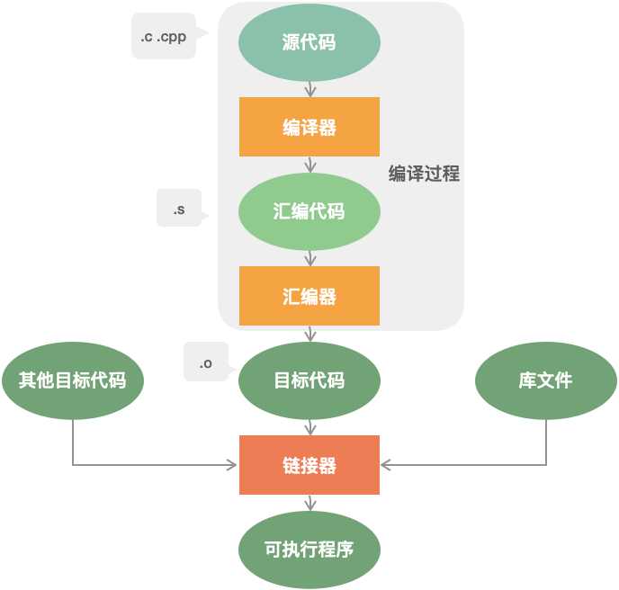
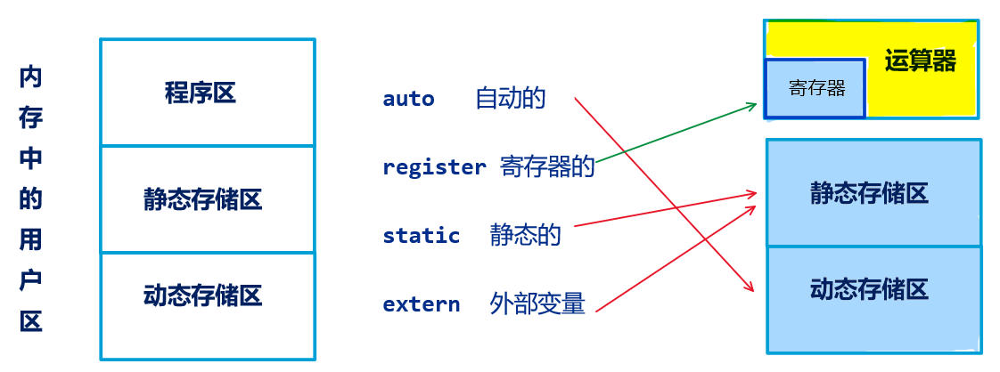

- [编译内存](#编译内存)
  - [C++ 程序编译过程](#c-程序编译过程)
    - [编译的四个过程](#编译的四个过程)
    - [静态链接库 vs 动态链接库](#静态链接库-vs-动态链接库)
  - [C++ 内存管理](#c-内存管理)
  - [栈和堆的区别](#栈和堆的区别)
  - [变量的区别](#变量的区别)
  - [全局变量定义在头文件中有什么问题？](#全局变量定义在头文件中有什么问题)

# 编译内存

本章是 C++ 面经的开章之作，其中涉及 C++ 程序的编译过程、内存以及头文件的一些知识点，重点在内存方面进行展开，包括内存的分区、内存对齐、内存泄漏、内存泄漏的防止方法、现有的检测内存泄漏的工具等等。由于问题之间的关联性，可能有些问题并非是本章相关的知识点，例如一些问题涉及到了类中的虚函数、创建类的对象的底层原理等等，但为了保持问题上下的连贯性，也放在了本章，便于问题的理解。

##  C++ 程序编译过程

面试高频指数：★★★★☆

###  编译的四个过程



- **编译预处理**：处理以 `#` 开头的指令；
- **编译、优化**：将源码 `.cpp` 文件翻译成 `.s` 汇编代码；
- **汇编**：将汇编代码 `.s` 翻译成机器指令 `.o` 文件；
- **链接**：汇编程序生成的目标文件，即 `.o` 文件，并不会立即执行，因为可能会出现：`.cpp` 文件中的函数引用了另一个 `.cpp` 文件中定义的符号或者调用了某个库文件中的函数。那链接的目的就是将这些文件对应的目标文件连接成一个整体，从而生成可执行的程序 `.exe` 文件。

### 静态链接库 vs 动态链接库

[B站视频：动态库与静态库讲解](https://www.bilibili.com/video/BV1XE411k7PN)

链接分为两种：

- **静态链接**：代码从其所在的静态链接库中拷贝到最终的可执行程序中，在该程序被执行时，这些代码会被装入到该进程的虚拟地址空间中。
- **动态链接**：代码被放到动态链接库或共享对象的某个目标文件中，链接程序只是在最终的可执行程序中记录了共享对象的名字等一些信息。在程序执行时，动态链接库的全部内容会被映射到运行时相应进行的虚拟地址的空间。

**二者的优缺点：**

- 静态链接：
  - 优点：代码合并到模块中，无零散文件。
  - 缺点：模块体积变大，当多个模块使用该库时，内存中有多份代码。
  - **浪费空间**，每个可执行程序都会有目标文件的一个副本，这样如果目标文件进行了更新操作，就需要重新进行编译链接生成可执行程序（**更新困难**）；优点就是执行的时候运行速度快，因为可执行程序具备了程序运行的所有内容。

- 动态链接：
  - 优点：模块体积几乎不变，当多个模块使用该库时，内存中只存在一份代码。
  - 缺点：代码在单独文件中，有零散文件。
  - 节省内存、更新方便，但是动态链接是在程序运行时，每次执行都需要链接，相比静态链接会有一定的性能损失。

## C++ 内存管理

面试高频指数：★★★★★

C++ 内存分区：栈、堆、全局/静态存储区、常量存储区、代码区。

- **栈**：存放函数的局部变量、函数参数、返回地址等，由编译器自动分配和释放。
- **堆**：动态申请的内存空间，就是由 `malloc` 分配的内存块，由程序员控制它的分配和释放，如果程序执行结束还没有释放，操作系统会自动回收。
- **全局区/静态存储区**（`.bss` 段和 `.data` 段）：存放全局变量和静态变量，程序运行结束操作系统自动释放，在 C 语言中，未初始化的放在 `.bss` 段中，初始化的放在 `.data` 段中，C++ 中不再区分了。
- **常量存储区**（`.data` 段）：存放的是常量，不允许修改，程序运行结束自动释放。
- **代码区**（`.text` 段）：存放代码，不允许修改，但可以执行。编译后的二进制文件存放在这里。

说明：

- 从操作系统的本身来讲，以上存储区在内存中的分布是如下形式(从低地址到高地址)：`.text` 段 --> `.data` 段 --> `.bss` 段 --> 堆 --> unused --> 栈 --> env

```cpp
#include <iostream>
using namespace std;

/*
说明：C++ 中不再区分初始化和未初始化的全局变量、静态变量的存储区，如果非要区分下述程序标注在了括号中
*/

int g_var = 0; // g_var 在全局区（.data 段）
char *gp_var;  // gp_var 在全局区（.bss 段）

int main()
{
    int var;                    // var 在栈区
    char *p_var;                // p_var 在栈区
    char arr[] = "abc";         // arr 为数组变量，存储在栈区；"abc"为字符串常量，存储在常量区
    char *p_var1 = "123456";    // p_var1 在栈区；"123456"为字符串常量，存储在常量区
    static int s_var = 0;       // s_var 为静态变量，存在静态存储区（.data 段）
    p_var = (char *)malloc(10); // 分配得来的 10 个字节的区域在堆区
    free(p_var);
    return 0;
}
```

## 栈和堆的区别

面试高频指数：★★★★★

- 申请方式：栈是系统自动分配，堆是程序员主动申请。
- 申请后系统响应：
  - 分配栈空间，如果剩余空间大于申请空间则分配成功，否则分配失败栈溢出；
  - 申请堆空间，堆在内存中呈现的方式类似于链表（记录空闲地址空间的链表），在链表上寻找第一个大于申请空间的节点分配给程序，将该节点从链表中删除，大多数系统中该块空间的首地址存放的是本次分配空间的大小，便于释放，将该块空间上的剩余空间再次连接在空闲链表上。
- 栈在内存中是连续的一块空间（向低地址扩展）最大容量是系统预定好的，堆在内存中的空间（向高地址扩展）是不连续的。
- 申请效率：栈是由系统自动分配，申请效率高，但程序员无法控制；堆是由程序员主动申请，效率低，使用起来方便但是容易产生碎片。
- 存放的内容：栈中存放的是局部变量，函数的参数；堆中存放的内容由程序员控制。

## 变量的区别

面试高频指数：★★★☆☆

**全局变量、局部变量、静态全局变量、静态局部变量的区别**

C++ 变量根据定义的位置的不同的生命周期，具有不同的作用域，作用域可分为 $6$ 种：全局作用域，局部作用域，语句作用域，类作用域，命名空间作用域和文件作用域。

从作用域看：

- **全局变量**：具有全局作用域。全局变量只需在一个源文件中定义，就可以作用于所有的源文件。当然，其他不包含全局变量定义的源文件需要用 `extern` 关键字再次声明这个全局变量。
- **静态全局变量**：具有文件作用域。它与全局变量的区别在于如果程序包含多个文件的话，它作用于定义它的文件里，不能作用到其它文件里，即被 `static` 关键字修饰过的变量具有文件作用域。这样即使两个不同的源文件都定义了相同名字的静态全局变量，它们也是不同的变量。
- **局部变量**：具有局部作用域。它是自动对象（`auto`），在程序运行期间不是一直存在，而是只在函数执行期间存在，函数的一次调用执行结束后，变量被撤销，其所占用的内存也被收回。
- **静态局部变量**：具有局部作用域。它只被初始化一次，自从第一次被初始化直到程序运行结束都一直存在，它和全局变量的区别在于全局变量对所有的函数都是可见的，而静态局部变量只对定义自己的函数体始终可见。

从分配内存空间看：

- 静态存储区：全局变量，静态局部变量，静态全局变量。
- 栈：局部变量。

说明：

- 静态变量和栈变量（存储在栈中的变量）、堆变量（存储在堆中的变量）的区别：静态变量会被放在程序的静态数据存储区（`.data` 段）中（静态变量会自动初始化），这样可以在下一次调用的时候还可以保持原来的赋值。而栈变量或堆变量不能保证在下一次调用的时候依然保持原来的值。
- 静态变量和全局变量的区别：静态变量用 `static` 告知编译器，自己仅仅在变量的作用范围内可见。

[视频：变量的存储属性](https://haokan.baidu.com/v?pd=wisenatural&vid=9053504529742668749)



- 存储属性的作用
  - 为局部变量指定存储属性的作用：确定**存储区**、影响**生存期**和存**取速度** （生存期：从分配存储单元到收回存储单元的时间段）
  - 为全局变量和函数指定存储属性的作用： 影响到其他源程序文件能否及如何使用它们是否将**作用域延伸**到其他源程序文件 
  - 全局变量和属性为 `static` 的局部静态变量分配在**静态区**具有最长的生存期：从分配到程序结束
  - 函数的**形参**和属性为 `auto` 的局部变量分配在动态区，生存期一般较短

- 局部量的存储属性
  - 自动变量
    1. 分配在**动态区**，**生存期**不超过函数的（本次）执行期
    2. 调用函数时分配存储单元，调用结束时释放存储单元
    3. **同一函数**两次调用，所占存储单元的位置可能不同
    4. 不指定初值，其**初值不确定**。指定的初值称**调用初值**（每调用一次赋一次初值）
  - 局部静态变量
    ```cpp
    int func2(int a) {
      static int r = 2, t; //r和t定义为静态变量
    }
    ```
    1. 分配在**静态区**（一直占到程序运行结束） **生存期**等同于整个程序的运行期
    2. 定义指定的初值称**编译初值**（只在编译时定一次初值） 上次调用的结果值，作为下次调用时的初值
  - 局部静态变量和自动变量对比
    1. 定义静态变量时给它赋初值（编译初值）
    2. 自动变量没有编译初值，只有调用初值。每调用一次，都为其赋一次初值。如果不指定初值，其初值是不确定的。
    3. 静态变量的生存期与全局变量相等
    4. 静态变量的作用域与自动变量相等

  - 寄存器变量
    1. 分配到寄存器中（不是分配在存储器中）
    2. 目的：**提高存取速度**
    ```cpp
    int func3(int x) {
      register int i, g = 1; //定义i和g为寄存器变量
      //...
    }
    ```
    3. 寄存器个数有限：没有分配到寄存器的变量，按自动变量处理。带优化功能的编译器自动将存取频繁的自动变量改为寄存器变量。
    4. 寄存器变量的生存期等同于自动变量

- 全局量的存储属性
  - 全局量：在函数外面定义的变量（有别于静态局部量）
  - 分配在用户的**静态存储区**内
  - **生存期**：从分配单元起，到程序运行结束
  - **作用域**：从第一次说明到文件尾（不重名时）
  - **静态全局变量**：定义时加 `static` 属性说明。**不允许**其他源程序文件使用
  - **外部全局变量**：定义时不加 `static` 属性说明。允许其他源程序文件使用（**要加声明**，声明的格式：`extern` 类型说明 全局变量名）

- 全局量存储属性用法示例

  

  - 源程序文件 $2$、$3$ 中不能使用 $a$
  - 源程序文件 $3$ 中可以使用 $b$（加了声明）
  - 源程序文件 $1$ 不能使用 $b$（没加声明）
  - 对 $b$ 的声明不能放在函数内部。在函数内部作 `extern` 声明的“外部变量”是本源程序中定义的全局变量，而不是别的源程序文件中定义的全局变量。

- 函数的存储属性
  - 内部函数（静态函数）：
    - 定义时加 `static` 属性说明
    - 不允许其他源程序文件使用
  - 外部函数：
    - 定义时加 `extern` 属性说明（或不加存储属性说明）
    - 允许其他源程序文件使用（要加声明）说明方式与外部全局变量相似

- 函数存储属性用法示例
  ```cpp
  //源程序文件1
  static int func1(int a, int b) //定义内部函数func1
  {...}

  extern int func2(int a[], int n) //定义外部函数func2
  {...}

  int func3(int a[], int n) //定义外部函数func3
  {...}
  ```

  ```cpp
  //源程序文件2
  //func1是静态内部函数，不允许其他源程序文件使用

  extern int func2(); //声明本文件要用到外部函数func2

  extern int func3(); //声明本文件要用到外部函数func3
  ```

| 属性名        | 含义     | 用处和示例                                                   | 生存期               | 意义                     |
| ------------- | -------- | ------------------------------------------------------------ | -------------------- | ------------------------ |
| `register`    | 寄存器的 | 定义局部变量，使其分配在寄存器中，例：`register int i;`      | 本函数内             | 加快存取速度             |
| `auto` 或缺省 | 自动的   | 定义局部变量，使其分配在动态区，例：`auto int x;`或`int x;`  | 本函数内             | 缩短生存期               |
| `static`      | 静态的   | 定义局部变量，使其分配在静态区，例：`static int a;`          | 本文件内             | 延长生存期               |
| `static`      | 静态的   | 在函数外部定义全局变量，使其作用域仅限于本文件中，例：`static int a[N];` | 本文件内             | 防止其他文件对其误操作   |
| `static`      | 静态的   | 定义函数，使其作用域咸鱼本文件，例：`static int func(int b, float x) {...}` |                      | 禁止其他文件使用         |
| `static`      | 静态的   | 对函数进行声明，例：`static int g();`                        |                      | 禁止其他文件使用         |
| `extern`      | 外部的   | 在函数外部定义用 `const` 修饰的全局变量（`TC` 默认），使其作用域扩展到其他文件，例：`extern const int M = 123;` | 使用该变量的所有文件 | 允许其他文件引用         |
| `extern`      | 外部的   | 在函数内部对使用的全局变量进行声明，例：`extern int a;`      |                      | 将作用域扩展到本函数     |
| `extern`      | 外部的   | 在函数外部对其他文件中定义的全局变量进行声明，例：`extern int b[M];` |                      | 将作用域扩展到本文件     |
| `extern`      | 外部的   | 对函数进行声明，例：`extern int g();`                        |                      | 使用其他文件中定义的函数 |

## 全局变量定义在头文件中有什么问题？

面试高频指数：★☆☆☆☆

如果在头文件中定义全局变量，当该头文件被多个文件 `include` 时，该头文件中的全局变量就会被定义多次，导致重复定义，因此不能再头文件中定义全局变量。


